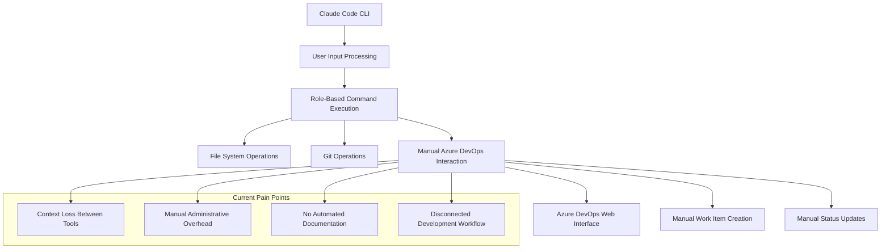
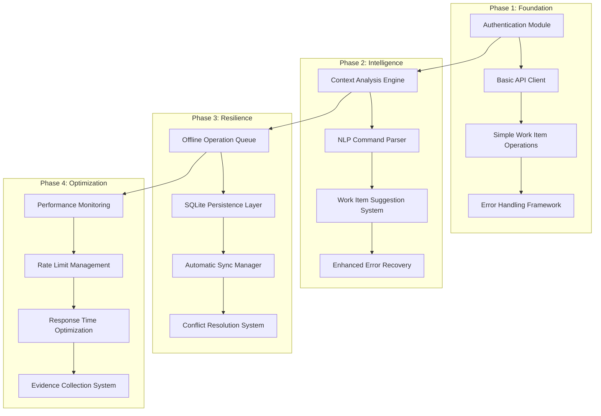
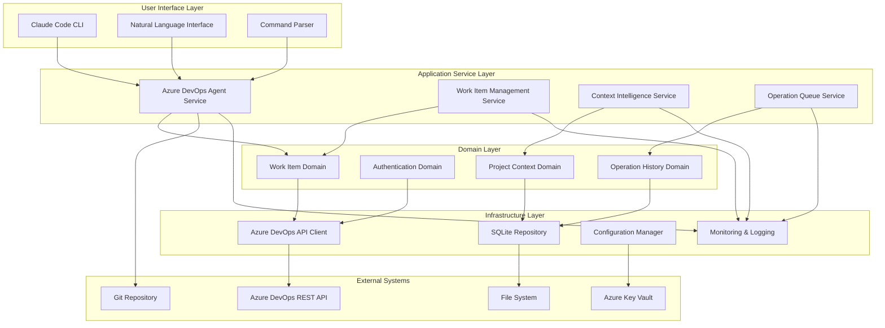
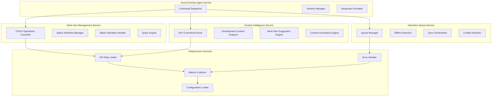
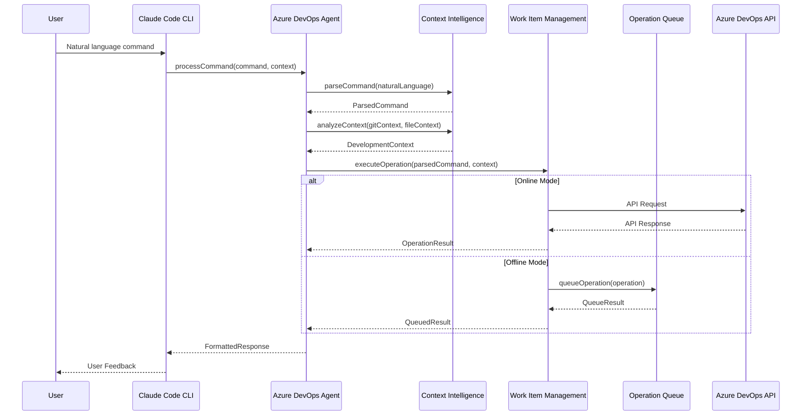
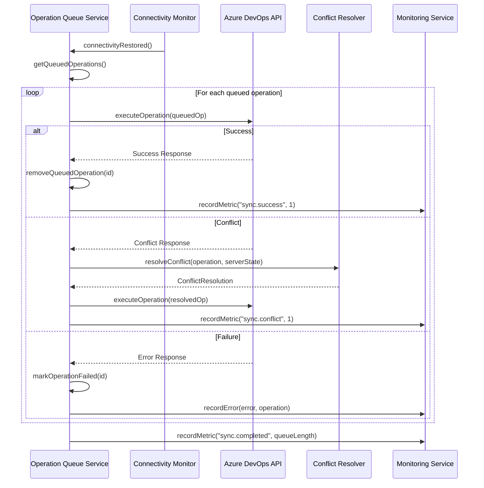
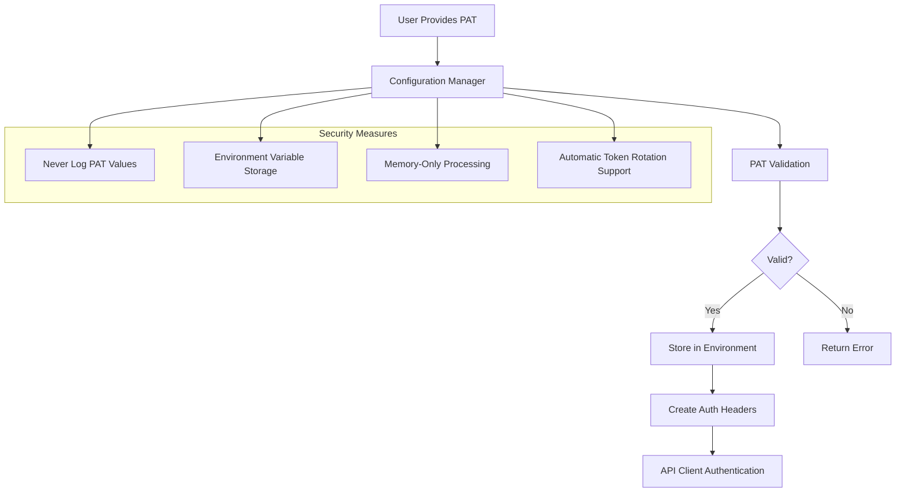
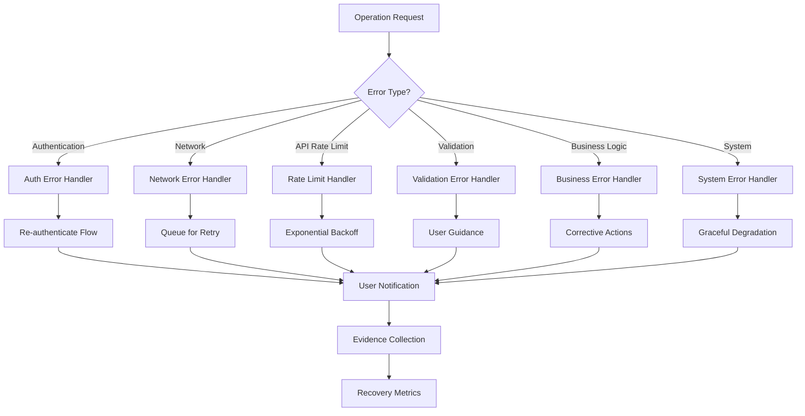
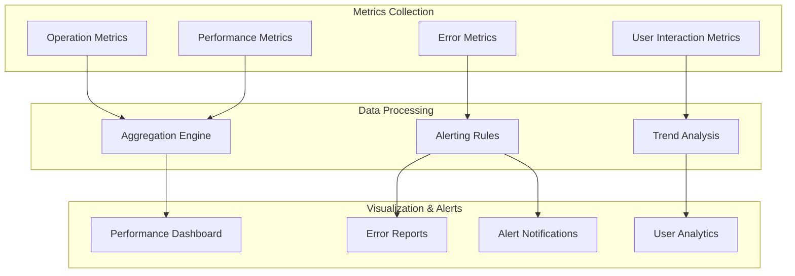

# Azure DevOps AI Agent - System Architecture

**Document Version**: 1.0  
**Date**: August 14, 2025  
**Architect**: Claude (Archie) - Solution Architect  
**Project**: Azure DevOps Integration for Claude Code  
**Organization**: https://dev.azure.com/dimitri0310/fnb-pricing/

---

## Executive Summary

This document defines the comprehensive system architecture for integrating Azure DevOps capabilities into Claude Code, enabling automated work item management through natural language interfaces. The architecture follows clean architecture principles, TOGAF methodology, and evidence-based design practices.

**Key Architectural Decisions**:
- REST API integration with Azure DevOps using PAT authentication
- Modular, event-driven architecture supporting offline operations
- SQLite-based persistence for operation queuing and configuration
- Instrumentation-first design for comprehensive evidence collection
- Response time target: <5 seconds for all operations

---

## 1. Baseline Architecture (Current State)

### 1.1 Current System Analysis



### 1.2 Current State Characteristics

**Strengths**:
- Established role-based architecture
- Strong file system and Git integration
- Robust command processing framework
- Evidence-based development practices

**Limitations**:
- No programmatic Azure DevOps integration
- Manual work item management (8-10 hours/week overhead)
- Context loss between development and project management
- No automated documentation of development outcomes
- Disconnected offline/online workflows

**Technical Debt**:
- No centralized configuration management for external services
- No established patterns for API integrations
- No offline operation queuing mechanisms
- No instrumentation for external service interactions

---

## 2. Transition Architecture (Migration Strategy)

### 2.1 Phased Integration Approach



### 2.2 Migration Risk Mitigation

**Risk**: Disruption to existing Claude Code functionality
- **Mitigation**: Additive architecture with feature flags
- **Fallback**: Graceful degradation to current manual processes

**Risk**: User adoption challenges
- **Mitigation**: Progressive enhancement with training integration
- **Validation**: A/B testing with pilot user groups

**Risk**: Azure DevOps API dependency
- **Mitigation**: Offline-first design with eventual consistency
- **Monitoring**: API health checks and fallback procedures

---

## 3. Target Architecture (Final System Design)

### 3.1 System Overview



### 3.2 Detailed Component Architecture



---

## 4. Module Definitions and Interfaces

### 4.1 Core Modules

#### 4.1.1 Azure DevOps Agent Service (ADS)

**Purpose**: Primary orchestration service coordinating all Azure DevOps operations

**Responsibilities**:
- Command parsing and routing
- Session state management
- Response formatting and user feedback
- Cross-cutting concern coordination

**Interface**:
```typescript
interface IAzureDevOpsAgentService {
    processCommand(command: string, context: SessionContext): Promise<OperationResult>;
    initializeSession(config: AuthConfig): Promise<SessionResult>;
    terminateSession(): Promise<void>;
    getSessionStatus(): SessionStatus;
}
```

**Dependencies**:
- Work Item Management Service
- Context Intelligence Service
- Operation Queue Service
- Configuration Manager

#### 4.1.2 Work Item Management Service (WIMS)

**Purpose**: Core business logic for work item CRUD operations

**Responsibilities**:
- Work item creation, reading, updating, deletion
- Status workflow enforcement
- Batch operation coordination
- Query execution and filtering

**Interface**:
```typescript
interface IWorkItemManagementService {
    createWorkItem(item: WorkItemCreate): Promise<WorkItemResult>;
    updateWorkItem(id: number, updates: WorkItemUpdate): Promise<WorkItemResult>;
    getWorkItem(id: number): Promise<WorkItemResult>;
    queryWorkItems(query: WorkItemQuery): Promise<WorkItemResult[]>;
    batchUpdate(operations: BatchOperation[]): Promise<BatchResult>;
}
```

**Dependencies**:
- Azure DevOps API Client
- Operation Queue Service
- Domain Models

#### 4.1.3 Context Intelligence Service (CIS)

**Purpose**: Natural language processing and context-aware suggestions

**Responsibilities**:
- Natural language command interpretation
- Development context analysis from Git/file system
- Work item suggestion generation
- Content enhancement for work items

**Interface**:
```typescript
interface IContextIntelligenceService {
    parseCommand(naturalLanguage: string): Promise<ParsedCommand>;
    analyzeContext(gitContext: GitContext, fileContext: FileContext): Promise<DevelopmentContext>;
    suggestWorkItem(context: DevelopmentContext): Promise<WorkItemSuggestion>;
    enhanceContent(baseContent: string, context: DevelopmentContext): Promise<string>;
}
```

**Dependencies**:
- Git Repository Interface
- File System Interface
- Configuration Manager

#### 4.1.4 Operation Queue Service (OQS)

**Purpose**: Offline operation management and eventual consistency

**Responsibilities**:
- Operation queuing during offline periods
- Connectivity monitoring
- Automatic synchronization
- Conflict detection and resolution

**Interface**:
```typescript
interface IOperationQueueService {
    queueOperation(operation: QueuedOperation): Promise<QueueResult>;
    processQueue(): Promise<ProcessResult>;
    getQueueStatus(): QueueStatus;
    resolveConflicts(conflicts: Conflict[]): Promise<ConflictResolution>;
}
```

**Dependencies**:
- SQLite Repository
- Azure DevOps API Client
- Connectivity Monitor

### 4.2 Infrastructure Modules

#### 4.2.1 Azure DevOps API Client

**Purpose**: Low-level HTTP client for Azure DevOps REST API

**Responsibilities**:
- HTTP request/response handling
- Authentication header management
- Rate limiting enforcement
- Response deserialization

**Interface**:
```typescript
interface IAzureDevOpsApiClient {
    authenticate(pat: string): Promise<AuthResult>;
    makeRequest<T>(endpoint: string, method: HttpMethod, data?: any): Promise<ApiResponse<T>>;
    getRateLimitStatus(): RateLimitInfo;
    isConnected(): Promise<boolean>;
}
```

#### 4.2.2 SQLite Repository

**Purpose**: Local data persistence for configuration and queue management

**Responsibilities**:
- Configuration storage and retrieval
- Operation queue persistence
- Query execution optimization
- Database migration management

**Interface**:
```typescript
interface ISqliteRepository {
    saveConfiguration(config: Configuration): Promise<void>;
    getConfiguration(): Promise<Configuration>;
    saveQueuedOperation(operation: QueuedOperation): Promise<number>;
    getQueuedOperations(): Promise<QueuedOperation[]>;
    removeQueuedOperation(id: number): Promise<void>;
}
```

#### 4.2.3 Configuration Manager

**Purpose**: Centralized configuration loading and validation

**Responsibilities**:
- Environment variable loading
- Configuration validation
- Secret management integration
- Default value application

**Interface**:
```typescript
interface IConfigurationManager {
    loadConfiguration(): Promise<Configuration>;
    validateConfiguration(config: Configuration): ValidationResult;
    updateConfiguration(updates: Partial<Configuration>): Promise<void>;
    getSecret(key: string): Promise<string>;
}
```

#### 4.2.4 Monitoring & Logging Service

**Purpose**: Comprehensive instrumentation and evidence collection

**Responsibilities**:
- Operation metrics collection
- Performance monitoring
- Error tracking and reporting
- User interaction analytics

**Interface**:
```typescript
interface IMonitoringService {
    recordMetric(name: string, value: number, tags?: Record<string, string>): void;
    recordOperation(operation: string, duration: number, success: boolean): void;
    recordError(error: Error, context?: any): void;
    getHealthStatus(): HealthStatus;
}
```

---

## 5. Data Flow and Integration Patterns

### 5.1 Command Processing Flow



### 5.2 Offline Operation Synchronization



---

## 6. Security and Authentication Architecture

### 6.1 PAT Authentication Flow



### 6.2 Security Architecture Principles

**Authentication Security**:
- PAT tokens stored only in environment variables
- No persistent storage of authentication credentials
- Memory-only token processing with automatic cleanup
- Support for token rotation without service interruption

**API Security**:
- HTTPS-only communication with Azure DevOps
- Request signing and validation
- Rate limiting to prevent abuse
- Comprehensive audit logging of all operations

**Data Protection**:
- No sensitive data in log files
- Encrypted local storage for queue operations
- Secure configuration handling
- Automatic data cleanup on session termination

**Access Control**:
- Principle of least privilege for API permissions
- Role-based access validation
- Operation-level permission checking
- User consent for destructive operations

---

## 7. Error Handling and Resilience Strategies

### 7.1 Error Classification Framework



### 7.2 Resilience Patterns

**Circuit Breaker Pattern**:
- Monitor API failure rates
- Temporary service degradation during outages
- Automatic recovery detection and restoration
- User notification of service status

**Retry Pattern**:
- Exponential backoff for transient failures
- Maximum retry limits to prevent infinite loops
- Jittered retry delays to prevent thundering herd
- Different retry strategies for different error types

**Bulkhead Pattern**:
- Isolate different operation types
- Prevent cascading failures between modules
- Resource allocation limits per operation category
- Independent error handling per bulkhead

**Timeout Pattern**:
- Configurable timeouts per operation type
- Graceful cancellation of long-running operations
- User feedback during extended operations
- Automatic fallback to offline mode

---

## 8. Performance and Monitoring Requirements

### 8.1 Performance Targets

| Metric | Target | Measurement Method |
|--------|--------|--------------------|
| Response Time | <5 seconds (95th percentile) | Request/response timing |
| API Rate Compliance | 100% (zero violations) | Rate limit monitoring |
| Offline Queue Processing | <30 seconds average | Queue processing time |
| Memory Usage | <100MB baseline | Process monitoring |
| Database Query Time | <100ms average | SQLite performance metrics |
| User Command Recognition | <1 second | NLP processing time |

### 8.2 Monitoring Architecture



### 8.3 Evidence Collection Strategy

**Operation Evidence**:
- Every API call logged with request/response metadata
- Operation success/failure rates with categorization
- Performance benchmarks for each operation type
- User satisfaction scores for suggestion accuracy

**System Health Evidence**:
- Real-time connectivity status monitoring
- Resource utilization tracking (CPU, memory, disk)
- Error rate monitoring with automatic alerting
- Queue depth and processing lag metrics

**User Behavior Evidence**:
- Command usage patterns and frequency
- Natural language interpretation accuracy
- Feature adoption rates and user preferences
- Workflow efficiency improvements (time saved)

**Quality Evidence**:
- Work item creation accuracy and completeness
- Documentation coverage and quality metrics
- Test outcome tracking and traceability
- Code-to-work-item correlation analysis

---

## 9. Implementation Roadmap

### 9.1 Development Phases

#### Phase 1: Foundation (Weeks 1-2)
**Deliverables**:
- Authentication Module with PAT support
- Basic Azure DevOps API Client
- Simple Work Item CRUD operations
- Error handling framework
- Initial monitoring infrastructure

**Success Criteria**:
- 100% authentication success rate
- Basic work item creation operational
- Comprehensive error logging active
- Performance baseline established

#### Phase 2: Intelligence (Weeks 3-4)
**Deliverables**:
- Natural language command parsing
- Context intelligence service
- Work item suggestion engine
- Enhanced error recovery system

**Success Criteria**:
- 70% command interpretation accuracy
- Context-aware suggestions implemented
- User feedback integration active
- Error recovery guidance operational

#### Phase 3: Resilience (Weeks 5-6)
**Deliverables**:
- Offline operation queuing system
- SQLite persistence layer
- Automatic synchronization manager
- Conflict resolution framework

**Success Criteria**:
- 100% offline operation queuing
- Zero data loss during connectivity issues
- Automatic sync operational
- Conflict resolution tested and validated

#### Phase 4: Optimization (Weeks 7-8)
**Deliverables**:
- Performance optimization
- Advanced monitoring and analytics
- User experience polish
- Comprehensive documentation

**Success Criteria**:
- <5 second response time target achieved
- Full evidence collection operational
- User satisfaction >90%
- Production readiness validated

### 9.2 Risk Mitigation Timeline

| Week | Risk Category | Mitigation Activity | Success Metric |
|------|---------------|---------------------|----------------|
| 1-2 | Authentication | PAT validation testing | 100% auth success |
| 2-3 | API Integration | Rate limiting implementation | Zero violations |
| 3-4 | User Experience | NLP accuracy testing | 70% interpretation |
| 4-5 | Data Integrity | Offline queue validation | Zero data loss |
| 5-6 | Performance | Response time optimization | 95% under 5s |
| 6-7 | Quality | End-to-end testing | All scenarios pass |
| 7-8 | Production | Load testing and monitoring | Production ready |

---

## 10. Sub-documents

*Note: When this architecture.md file exceeds 500 lines, the following sub-documents will be created:*

1. **security-architecture.md** - Detailed security specifications and threat modeling
2. **api-integration.md** - Azure DevOps API integration patterns and specifications  
3. **data-architecture.md** - Database design, queuing mechanisms, and data flow
4. **monitoring-architecture.md** - Comprehensive monitoring, logging, and evidence collection
5. **deployment-architecture.md** - Deployment strategies, environments, and CI/CD integration

*Each sub-document will reference this architecture.md version 1.0 as the foundational specification.*

---

## Version History

| Version | Date | Changes | Author |
|---------|------|---------|---------|
| 1.0 | August 14, 2025 | Initial comprehensive architecture design | Claude (Archie) |

---

## Appendices

### Appendix A: Technology Stack

**Core Technologies**:
- **Runtime**: Node.js (LTS version for Claude Code compatibility)
- **Language**: TypeScript (for type safety and better maintainability)
- **Database**: SQLite (for local persistence and queue management)
- **HTTP Client**: Axios (for Azure DevOps API integration)
- **Testing**: Jest (for unit and integration testing)
- **Build**: TypeScript Compiler with Node.js build scripts

**Azure DevOps Integration**:
- **API Version**: REST API v7.2
- **Authentication**: Personal Access Token (PAT)
- **Rate Limiting**: Respect Azure DevOps service limits
- **Response Format**: JSON with comprehensive error handling

### Appendix B: Configuration Schema

```typescript
interface Configuration {
  azureDevOps: {
    organization: string;
    project: string;
    pat: string; // Environment variable reference
    apiVersion: string;
    timeout: number;
    retryAttempts: number;
  };
  storage: {
    databasePath: string;
    maxQueueSize: number;
    syncInterval: number;
  };
  monitoring: {
    metricsEnabled: boolean;
    logLevel: string;
    performanceTracking: boolean;
  };
  features: {
    offlineMode: boolean;
    naturalLanguageProcessing: boolean;
    contextAwareness: boolean;
    batchOperations: boolean;
  };
}
```

### Appendix C: API Endpoint Mapping

| Operation | Azure DevOps Endpoint | HTTP Method | Rate Limit |
|-----------|------------------------|-------------|------------|
| Create Work Item | `/_apis/wit/workitems/$type` | POST | Standard |
| Update Work Item | `/_apis/wit/workitems/{id}` | PATCH | Standard |
| Get Work Item | `/_apis/wit/workitems/{id}` | GET | High |
| Query Work Items | `/_apis/wit/wiql` | POST | Standard |
| Batch Update | `/_apis/wit/workitemsbatch` | POST | Limited |

---

*This architecture document provides the comprehensive foundation for implementing the Azure DevOps AI Agent integration, ensuring scalable, maintainable, and evidence-based development practices.*