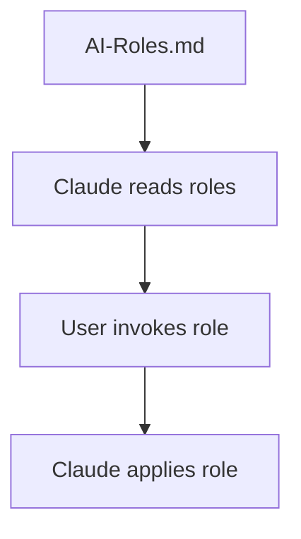
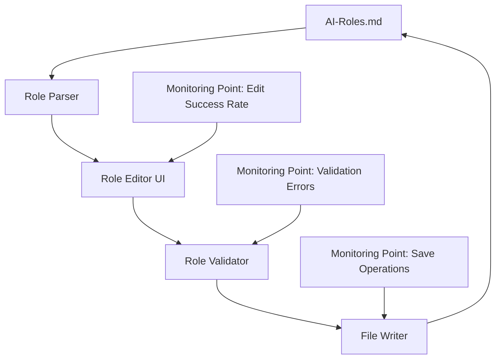

# Role Editor Architecture

## Version History
- v1.0 - 2025-07-28 - Initial architecture for role editor enhancement

## Overview
This document defines the minimal architecture for enhancing role editing capabilities in the Claude Code AI Agents system. The design follows the "build the minimum first" principle, focusing on core functionality that can be validated through real usage.

## Problem Statement
Currently, role definitions are stored in a single AI-Roles.md file. Users need a way to:
1. Edit existing roles through a structured interface
2. Add new roles following the established pattern
3. Validate role definitions before saving
4. Track changes to role definitions

## Target Conditions

### Basic Version (Core Functionality Demo)
- Display role list from AI-Roles.md
- Edit role definition text directly
- Save changes back to AI-Roles.md
- No error handling, validation, or UI polish
- Success metric: Can a user edit and save a role definition under ideal conditions?

### MVP (Validated Product)
- Structured role editor with field validation
- Role template for new roles
- Basic version control integration
- Error handling and user feedback
- Success metric: 90% of role editing tasks completed without errors

## System Architecture

### Baseline Architecture (Current State)


### Target Architecture (Basic Version)


### Modules

#### 1. Role Parser Module
**Purpose**: Extract structured role data from AI-Roles.md
**Input**: AI-Roles.md file content
**Output**: Structured role objects
**Monitoring**: Parse time, parse errors, role count

```
Structure:
{
  "roleName": "@project-initiator",
  "title": "Project Initiator",
  "definition": "Role definition text...",
  "customInstructions": ["instruction1", "instruction2", ...],
  "whenClaudeSuggests": "Suggestion text..."
}
```

#### 2. Role Editor UI Module
**Purpose**: Provide interface for editing role definitions
**Input**: Structured role objects
**Output**: Modified role objects
**Monitoring**: Edit completion rate, time per edit, field usage

Components:
- Role list view
- Role detail editor
- Field validators
- Save/Cancel actions

#### 3. Role Validator Module
**Purpose**: Ensure role definitions meet requirements
**Input**: Modified role object
**Output**: Validation result with errors
**Monitoring**: Validation pass rate, common errors

Validation Rules:
- Role name format (@lowercase-hyphenated)
- Required fields present
- Custom instructions properly numbered
- No duplicate role names

#### 4. File Writer Module
**Purpose**: Write validated roles back to AI-Roles.md
**Input**: Validated role objects
**Output**: Updated AI-Roles.md file
**Monitoring**: Write success rate, file size, backup creation

## Data Flow

1. **Load**: Parse AI-Roles.md → Extract roles → Display in editor
2. **Edit**: User modifies role → Real-time validation → Show feedback
3. **Save**: Validate all → Create backup → Write file → Confirm success

## Technology Stack (Basic Version)

- **Frontend**: Simple HTML/CSS/JavaScript (no framework)
- **Backend**: Node.js with file system operations
- **Storage**: Direct file manipulation of AI-Roles.md
- **Validation**: JavaScript validation functions

## Measurement Strategy

### Technical Metrics to Capture
1. **Performance**: File parse time, save time, UI response time
2. **Reliability**: Parse error rate, save failure rate, data corruption incidents
3. **Usage**: Edit frequency, most edited fields, session duration
4. **Quality**: Validation error types, user correction patterns

### Success Validation
- Instrumentation hooks in each module
- Error logging with context
- Performance timing for key operations
- User action tracking (anonymized)

## Implementation Priorities

### Phase 1: Basic Version (Must Have)
1. Parse existing AI-Roles.md structure
2. Display roles in simple list
3. Edit role definition in textarea
4. Save changes back to file

### Phase 2: MVP Enhancements (Should Have)
1. Structured field editing
2. Real-time validation
3. Role templates
4. Backup before save
5. Error handling

### Phase 3: Future Improvements (Could Have)
1. Version history tracking
2. Role testing interface
3. Bulk operations
4. Export/import roles

## Constraints

1. Must preserve existing AI-Roles.md format
2. Changes must be compatible with current Claude role invocation
3. No external dependencies for Basic Version
4. File size limit of 500 lines for this architecture doc

## Next Steps

1. Create task breakdown with @planner
2. Implement parser module first
3. Build minimal UI for testing
4. Add instrumentation from day one
5. Validate with real user editing tasks

## sub-documents
None yet - will create as architecture grows