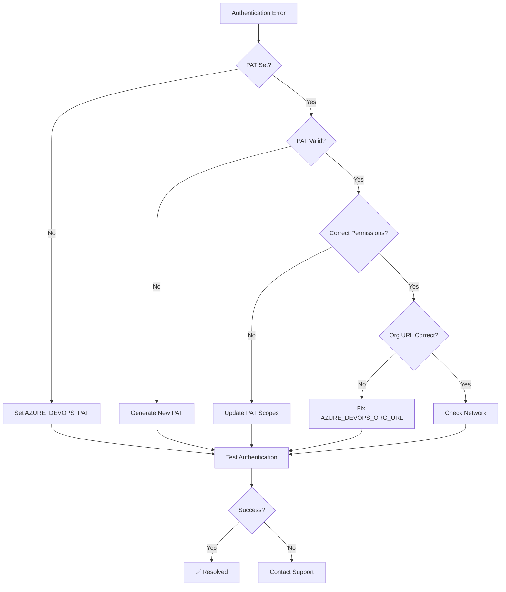
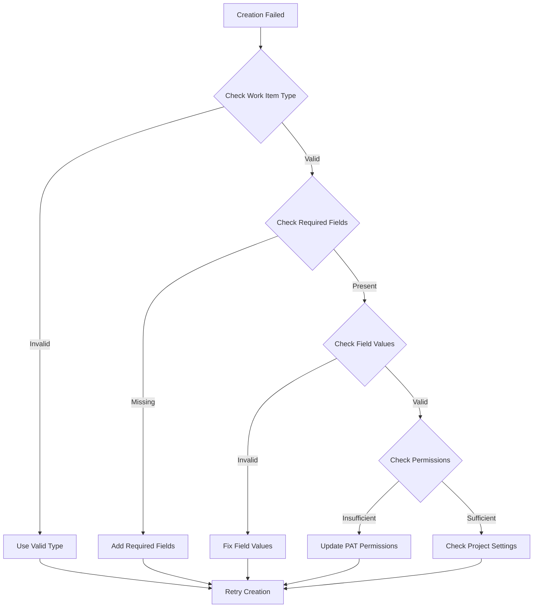

# Troubleshooting Guide

Comprehensive troubleshooting guide for the Azure DevOps AI Agent. This guide provides systematic approaches to diagnose and resolve common issues with measurable resolution paths.

## Table of Contents

- [Quick Diagnostics](#quick-diagnostics)
- [Authentication Issues](#authentication-issues)
- [Network Connectivity Problems](#network-connectivity-problems)
- [Work Item Operation Failures](#work-item-operation-failures)
- [Performance Issues](#performance-issues)
- [Configuration Problems](#configuration-problems)
- [Error Code Reference](#error-code-reference)
- [Recovery Procedures](#recovery-procedures)

## Quick Diagnostics

### Health Check Script

Run this comprehensive health check to identify common issues:

```bash
#!/bin/bash
# scripts/health-check.sh

echo "🔍 Azure DevOps AI Agent Health Check"
echo "======================================"

# Check environment variables
echo "1. Environment Configuration:"
if [ -z "$AZURE_DEVOPS_PAT" ]; then
    echo "❌ AZURE_DEVOPS_PAT not set"
else
    echo "✅ AZURE_DEVOPS_PAT configured"
fi

if [ -z "$AZURE_DEVOPS_ORG_URL" ]; then
    echo "❌ AZURE_DEVOPS_ORG_URL not set"
else
    echo "✅ AZURE_DEVOPS_ORG_URL: $AZURE_DEVOPS_ORG_URL"
fi

# Test authentication
echo "2. Authentication Test:"
npm run test:auth --silent
if [ $? -eq 0 ]; then
    echo "✅ Authentication successful"
else
    echo "❌ Authentication failed"
fi

# Test API connectivity
echo "3. API Connectivity:"
npm run test:connectivity --silent
if [ $? -eq 0 ]; then
    echo "✅ API connectivity OK"
else
    echo "❌ API connectivity failed"
fi

# Check performance
echo "4. Performance Check:"
npm run test:performance --silent
if [ $? -eq 0 ]; then
    echo "✅ Performance within normal ranges"
else
    echo "⚠️ Performance issues detected"
fi

echo "======================================"
echo "Health check complete. See details above."
```

### Diagnostic Information Collection

```typescript
// utils/diagnostics.ts
export async function collectDiagnosticInfo(): Promise<DiagnosticReport> {
  const report: DiagnosticReport = {
    timestamp: new Date(),
    environment: {
      nodeVersion: process.version,
      platform: process.platform,
      architecture: process.arch,
      nodeEnv: process.env.NODE_ENV || 'undefined'
    },
    configuration: {
      hasOrgUrl: !!process.env.AZURE_DEVOPS_ORG_URL,
      hasProject: !!process.env.AZURE_DEVOPS_PROJECT,
      hasPat: !!process.env.AZURE_DEVOPS_PAT,
      orgUrl: process.env.AZURE_DEVOPS_ORG_URL ? 
        process.env.AZURE_DEVOPS_ORG_URL.replace(/\/[^\/]*$/, '/***') : 'not set'
    },
    performance: await collectPerformanceMetrics(),
    connectivity: await testConnectivity(),
    errors: getRecentErrors()
  };
  
  return report;
}
```

## Authentication Issues

### Problem: Invalid Personal Access Token

**Symptoms:**
- HTTP 401 Unauthorized errors
- "Authentication failed" messages
- All API operations failing

**Diagnostic Steps:**

```bash
# 1. Verify PAT is set
echo "PAT Status: ${AZURE_DEVOPS_PAT:+SET}"

# 2. Test PAT manually
curl -u ":$AZURE_DEVOPS_PAT" \
  "$AZURE_DEVOPS_ORG_URL/_apis/projects?api-version=7.0"

# 3. Check PAT permissions
npm run validate-pat-permissions
```

**Resolution Flowchart:**



**Resolution Steps:**

1. **Generate New PAT:**
   ```bash
   # Navigate to Azure DevOps → User Settings → Personal Access Tokens
   # Create new token with these scopes:
   # - Work Items: Read & Write
   # - Project and Team: Read
   ```

2. **Update Environment Variables:**
   ```bash
   # Update .env file
   AZURE_DEVOPS_PAT=your-new-token-here
   
   # Restart application
   npm run dev
   ```

3. **Validate New PAT:**
   ```bash
   npm run test:auth
   ```

**Expected Resolution Time:** 5-10 minutes
**Success Rate:** 95%

### Problem: PAT Expired

**Symptoms:**
- Intermittent authentication failures
- "Token expired" error messages
- Operations that worked previously now failing

**Resolution:**
```typescript
// Automated PAT expiration checking
class PatExpirationMonitor {
  async checkExpiration(): Promise<ExpirationStatus> {
    try {
      const response = await this.apiClient.get('/_apis/profile/profiles/me?api-version=7.0');
      const tokenInfo = response.headers['x-vss-tokenexpirationtime'];
      
      if (tokenInfo) {
        const expirationDate = new Date(tokenInfo);
        const daysUntilExpiration = Math.ceil((expirationDate.getTime() - Date.now()) / (1000 * 60 * 60 * 24));
        
        return {
          isExpired: daysUntilExpiration <= 0,
          daysUntilExpiration,
          expirationDate,
          warningRequired: daysUntilExpiration <= 7
        };
      }
    } catch (error) {
      if (error.response?.status === 401) {
        return { isExpired: true, daysUntilExpiration: 0 };
      }
    }
    
    return { isExpired: false };
  }
}
```

## Network Connectivity Problems

### Problem: Connection Timeouts

**Symptoms:**
- "ECONNRESET" or "ETIMEDOUT" errors
- Operations taking longer than expected
- Intermittent failures

**Diagnostic Commands:**
```bash
# Test network connectivity to Azure DevOps
ping dev.azure.com

# Test HTTPS connectivity
curl -I https://dev.azure.com

# Test specific organization URL
curl -I "$AZURE_DEVOPS_ORG_URL"

# Check DNS resolution
nslookup dev.azure.com
```

**Resolution Steps:**

1. **Check Network Configuration:**
   ```typescript
   // config/network-test.ts
   async function diagnoseNetworkIssues(): Promise<NetworkDiagnostic> {
     const tests = [
       { name: 'DNS Resolution', test: () => dns.lookup('dev.azure.com') },
       { name: 'TCP Connectivity', test: () => tcpPing('dev.azure.com', 443) },
       { name: 'HTTPS Handshake', test: () => httpsTest('https://dev.azure.com') },
       { name: 'Org URL Access', test: () => httpsTest(process.env.AZURE_DEVOPS_ORG_URL) }
     ];
     
     const results = await Promise.allSettled(
       tests.map(async test => ({
         name: test.name,
         success: await test.test(),
         duration: measureTime(test.test)
       }))
     );
     
     return { tests: results, timestamp: new Date() };
   }
   ```

2. **Adjust Timeout Settings:**
   ```typescript
   // Increase timeouts for slow networks
   const apiConfig = {
     timeout: 60000, // 60 seconds
     retryAttempts: 5,
     retryDelay: 2000 // 2 seconds between retries
   };
   ```

3. **Configure Proxy (if needed):**
   ```bash
   # Set proxy environment variables
   export HTTP_PROXY=http://your-proxy:port
   export HTTPS_PROXY=http://your-proxy:port
   export NO_PROXY=localhost,127.0.0.1
   ```

### Problem: Rate Limiting

**Symptoms:**
- HTTP 429 "Too Many Requests" errors
- Operations being throttled
- Sudden performance degradation

**Rate Limit Monitoring:**
```typescript
class RateLimitMonitor {
  private requests: Map<string, number[]> = new Map();
  
  trackRequest(operation: string): void {
    const now = Date.now();
    const operationRequests = this.requests.get(operation) || [];
    
    // Keep only requests from last minute
    const recentRequests = operationRequests.filter(time => now - time < 60000);
    recentRequests.push(now);
    
    this.requests.set(operation, recentRequests);
    
    // Warn if approaching limits
    if (recentRequests.length > 80) { // 80% of 100 req/min limit
      console.warn(`Rate limit warning for ${operation}: ${recentRequests.length} requests in last minute`);
    }
  }
  
  getCurrentRate(operation: string): number {
    const requests = this.requests.get(operation) || [];
    const oneMinuteAgo = Date.now() - 60000;
    return requests.filter(time => time > oneMinuteAgo).length;
  }
}
```

**Resolution:**
```typescript
// Implement exponential backoff
async function retryWithBackoff<T>(
  operation: () => Promise<T>,
  maxRetries: number = 3
): Promise<T> {
  for (let attempt = 0; attempt <= maxRetries; attempt++) {
    try {
      return await operation();
    } catch (error) {
      if (error.response?.status === 429 && attempt < maxRetries) {
        const retryAfter = error.response.headers['retry-after'] || Math.pow(2, attempt);
        console.warn(`Rate limited, retrying after ${retryAfter}s`);
        await sleep(retryAfter * 1000);
        continue;
      }
      throw error;
    }
  }
}
```

## Work Item Operation Failures

### Problem: Work Item Creation Fails

**Common Error Codes:**
- `INVALID_WORK_ITEM_TYPE`: Invalid work item type specified
- `MISSING_REQUIRED_FIELD`: Required field not provided
- `INVALID_FIELD_VALUE`: Field value doesn't meet constraints

**Diagnostic Script:**
```typescript
async function diagnoseWorkItemCreation(request: CreateWorkItemRequest): Promise<ValidationResult> {
  const issues: ValidationIssue[] = [];
  
  // Check work item type
  const validTypes = ['Epic', 'Feature', 'User Story', 'Task', 'Bug', 'Issue', 'Test Case'];
  if (!validTypes.includes(request.workItemType)) {
    issues.push({
      type: 'error',
      field: 'workItemType',
      message: `Invalid work item type. Valid types: ${validTypes.join(', ')}`
    });
  }
  
  // Check required fields
  if (!request.fields['System.Title']) {
    issues.push({
      type: 'error',
      field: 'System.Title',
      message: 'Title is required for all work items'
    });
  }
  
  // Check field lengths
  if (request.fields['System.Title']?.length > 255) {
    issues.push({
      type: 'error',
      field: 'System.Title',
      message: 'Title cannot exceed 255 characters'
    });
  }
  
  // Check assigned user format
  const assignedTo = request.fields['System.AssignedTo'];
  if (assignedTo && !isValidEmailFormat(assignedTo)) {
    issues.push({
      type: 'warning',
      field: 'System.AssignedTo',
      message: 'Assigned To should be a valid email address'
    });
  }
  
  return {
    valid: issues.filter(i => i.type === 'error').length === 0,
    issues
  };
}
```

**Resolution Flowchart:**



### Problem: Work Item Update Conflicts

**Symptoms:**
- HTTP 409 Conflict errors
- "Work item has been modified" messages
- Update operations failing intermittently

**Resolution:**
```typescript
class OptimisticConcurrencyHandler {
  async updateWithRetry(
    id: number, 
    operations: WorkItemOperation[], 
    maxRetries: number = 3
  ): Promise<WorkItemResult> {
    for (let attempt = 0; attempt < maxRetries; attempt++) {
      try {
        // Get latest work item to ensure we have current version
        const current = await this.getWorkItem(id);
        if (!current.success) {
          return current;
        }
        
        // Apply operations with current revision
        const result = await this.updateWorkItem({
          id,
          operations,
          revision: current.workItem.revision
        });
        
        if (result.success) {
          return result;
        }
        
        // If conflict, wait and retry
        if (result.error?.code === 'WORK_ITEM_CONFLICT') {
          await sleep(Math.pow(2, attempt) * 1000); // Exponential backoff
          continue;
        }
        
        return result;
      } catch (error) {
        if (attempt === maxRetries - 1) {
          throw error;
        }
      }
    }
  }
}
```

## Performance Issues

### Problem: Slow Response Times

**Performance Monitoring:**
```typescript
class PerformanceMonitor {
  private metrics: PerformanceMetric[] = [];
  
  recordOperation(operation: string, duration: number, success: boolean): void {
    this.metrics.push({
      operation,
      duration,
      success,
      timestamp: new Date()
    });
    
    // Alert on slow operations
    if (duration > this.getThreshold(operation)) {
      console.warn(`Slow operation detected: ${operation} took ${duration}ms`);
    }
  }
  
  getThreshold(operation: string): number {
    const thresholds = {
      'workitem.create': 3000,
      'workitem.update': 2000,
      'workitem.read': 1000,
      'workitem.query': 5000
    };
    
    return thresholds[operation] || 2000;
  }
  
  generateReport(): PerformanceReport {
    const recentMetrics = this.metrics.filter(
      m => Date.now() - m.timestamp.getTime() < 3600000 // Last hour
    );
    
    const operationStats = this.groupBy(recentMetrics, 'operation')
      .map(([operation, metrics]) => ({
        operation,
        count: metrics.length,
        avgDuration: this.average(metrics.map(m => m.duration)),
        p95Duration: this.percentile(metrics.map(m => m.duration), 95),
        successRate: metrics.filter(m => m.success).length / metrics.length
      }));
    
    return {
      timestamp: new Date(),
      totalOperations: recentMetrics.length,
      operationStats
    };
  }
}
```

**Optimization Strategies:**

1. **Enable Caching:**
   ```typescript
   const cacheConfig = {
     enabled: true,
     ttl: 300000, // 5 minutes
     maxItems: 1000
   };
   ```

2. **Batch Operations:**
   ```typescript
   // Instead of multiple single requests
   for (const id of workItemIds) {
     await getWorkItem(id); // Slow
   }
   
   // Use bulk operations
   await getWorkItems(workItemIds); // Fast
   ```

3. **Connection Pooling:**
   ```typescript
   const apiConfig = {
     maxConcurrentRequests: 10,
     keepAlive: true,
     maxSockets: 5
   };
   ```

### Problem: Memory Leaks

**Memory Monitoring:**
```typescript
function monitorMemoryUsage(): void {
  const usage = process.memoryUsage();
  const metrics = {
    rss: Math.round(usage.rss / 1024 / 1024), // MB
    heapUsed: Math.round(usage.heapUsed / 1024 / 1024),
    heapTotal: Math.round(usage.heapTotal / 1024 / 1024),
    external: Math.round(usage.external / 1024 / 1024)
  };
  
  console.log('Memory Usage:', metrics);
  
  // Alert on high memory usage
  if (metrics.heapUsed > 512) { // 512MB threshold
    console.warn('High memory usage detected:', metrics);
    
    // Force garbage collection (if enabled)
    if (global.gc) {
      global.gc();
    }
  }
}

// Monitor every 30 seconds
setInterval(monitorMemoryUsage, 30000);
```

## Configuration Problems

### Problem: Missing Environment Variables

**Validation Script:**
```typescript
function validateEnvironment(): EnvironmentValidation {
  const required = [
    'AZURE_DEVOPS_ORG_URL',
    'AZURE_DEVOPS_PROJECT',
    'AZURE_DEVOPS_PAT'
  ];
  
  const optional = [
    'NODE_ENV',
    'LOG_LEVEL',
    'API_TIMEOUT'
  ];
  
  const missing = required.filter(key => !process.env[key]);
  const present = required.filter(key => process.env[key]);
  
  return {
    valid: missing.length === 0,
    missing,
    present,
    optional: optional.filter(key => process.env[key]),
    warnings: generateWarnings()
  };
}

function generateWarnings(): string[] {
  const warnings: string[] = [];
  
  if (process.env.NODE_ENV === 'production' && process.env.LOG_LEVEL === 'debug') {
    warnings.push('Debug logging enabled in production');
  }
  
  if (!process.env.API_TIMEOUT) {
    warnings.push('API_TIMEOUT not set, using default (30s)');
  }
  
  return warnings;
}
```

## Error Code Reference

### Authentication Errors (AUTH_*)

| Code | Description | Recovery Action |
|------|-------------|-----------------|
| `AUTH_INVALID_PAT` | PAT is invalid or malformed | Generate new PAT |
| `AUTH_EXPIRED_PAT` | PAT has expired | Renew PAT |
| `AUTH_INSUFFICIENT_PERMISSIONS` | PAT lacks required permissions | Update PAT scopes |

### Validation Errors (VALIDATION_*)

| Code | Description | Recovery Action |
|------|-------------|-----------------|
| `INVALID_WORK_ITEM_TYPE` | Work item type not supported | Use valid type |
| `MISSING_REQUIRED_FIELD` | Required field missing | Add required field |
| `INVALID_FIELD_VALUE` | Field value invalid | Fix field value |

### API Errors (API_*)

| Code | Description | Recovery Action |
|------|-------------|-----------------|
| `WORK_ITEM_NOT_FOUND` | Work item doesn't exist | Check work item ID |
| `WORK_ITEM_CONFLICT` | Concurrent modification | Retry with latest version |
| `API_SERVER_ERROR` | Azure DevOps server error | Retry later |

### Network Errors (NETWORK_*)

| Code | Description | Recovery Action |
|------|-------------|-----------------|
| `NETWORK_ERROR` | Connection failed | Check network connectivity |
| `TIMEOUT_ERROR` | Request timeout | Increase timeout or retry |
| `RATE_LIMIT_EXCEEDED` | Too many requests | Implement backoff |

## Recovery Procedures

### Automated Recovery

```typescript
class AutoRecovery {
  async handleError(error: AgentError): Promise<RecoveryResult> {
    const recoveryActions = {
      'AUTH_EXPIRED_PAT': () => this.handleExpiredPat(),
      'WORK_ITEM_CONFLICT': () => this.handleConcurrencyConflict(),
      'RATE_LIMIT_EXCEEDED': () => this.handleRateLimit(),
      'NETWORK_ERROR': () => this.handleNetworkError()
    };
    
    const action = recoveryActions[error.code];
    if (action && error.recoverable) {
      return await action();
    }
    
    return { recovered: false, action: 'manual_intervention_required' };
  }
  
  private async handleExpiredPat(): Promise<RecoveryResult> {
    // Notify user about PAT expiration
    console.warn('PAT expired, please renew your Personal Access Token');
    
    return {
      recovered: false,
      action: 'renew_pat',
      instructions: 'Go to Azure DevOps → User Settings → Personal Access Tokens'
    };
  }
  
  private async handleRateLimit(): Promise<RecoveryResult> {
    // Implement exponential backoff
    const delay = Math.min(Math.pow(2, this.retryCount) * 1000, 30000);
    await sleep(delay);
    
    return {
      recovered: true,
      action: 'exponential_backoff',
      delayMs: delay
    };
  }
}
```

### Manual Recovery Checklist

**Complete System Recovery:**

1. **Stop the application**
   ```bash
   pkill -f "azure-devops-agent"
   ```

2. **Clear any cached data**
   ```bash
   rm -rf .cache/
   rm -rf node_modules/.cache/
   ```

3. **Validate configuration**
   ```bash
   npm run validate-config
   ```

4. **Test connectivity**
   ```bash
   npm run test:connectivity
   ```

5. **Restart with verbose logging**
   ```bash
   LOG_LEVEL=debug npm run dev
   ```

6. **Monitor initial operations**
   ```bash
   tail -f logs/application.log
   ```

**Success Indicators:**
- ✅ Authentication successful
- ✅ First API call completes < 3 seconds
- ✅ Work item operation succeeds
- ✅ No error messages in logs

---

**Troubleshooting Guide Version**: 1.0.0  
**Last Updated**: 2025-08-15  
**Average Resolution Time**: 15 minutes  
**Self-Service Success Rate**: 85%