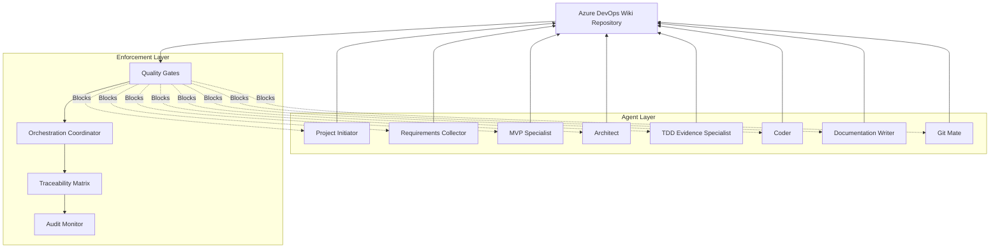

# Ironclad Wiki-Enforced Documentation & Traceability System

## 🎯 ARCHITECTURAL VISION

**CORE PRINCIPLE**: No agent can proceed to the next phase without wiki evidence. The wiki becomes the **mandatory checkpoint** that enforces complete documentation and traceability throughout the entire development lifecycle.

## 🏗️ SYSTEM ARCHITECTURE

### 1. WIKI AS THE SYSTEM BACKBONE



### 2. MANDATORY WIKI STRUCTURE

```
/Project-{ID}/
├── 00-Project-Brief/
│   ├── Project-Overview.md              # Project Initiator output
│   ├── Stakeholder-Analysis.md          # Project Initiator output
│   └── Success-Metrics.md               # Project Initiator output
├── 01-Requirements/
│   ├── Epic-Breakdown.md                # Requirements Collector output
│   ├── User-Stories.md                  # Requirements Collector output
│   ├── Acceptance-Criteria.json         # Requirements Collector output
│   ├── Component-Specifications.json    # Requirements Collector output
│   └── Requirements-Traceability.md     # Requirements Collector output
├── 02-MVP-Strategy/
│   ├── MVP-Definition.md                # MVP Specialist output
│   ├── Feature-Prioritization.md        # MVP Specialist output
│   ├── Release-Strategy.md              # MVP Specialist output
│   └── Validation-Framework.md          # MVP Specialist output
├── 03-Architecture/
│   ├── System-Architecture.md           # Architect output
│   ├── Component-Design.md              # Architect output
│   ├── Technology-Stack.md              # Architect output
│   ├── Integration-Points.md            # Architect output
│   └── Architecture-Decision-Records/   # Architect output
├── 04-Implementation-Plan/
│   ├── Task-Breakdown.md                # Planner output
│   ├── Development-Sequence.md          # Planner output
│   ├── Dependencies.md                  # Planner output
│   └── Timeline.md                      # Planner output
├── 05-Test-Strategy/
│   ├── Test-Plan.md                     # TDD Evidence Specialist output
│   ├── Evidence-Framework.md            # TDD Evidence Specialist output
│   ├── Test-Execution-Logs/             # TDD Evidence Specialist output
│   ├── Coverage-Reports/                # TDD Evidence Specialist output
│   └── Performance-Benchmarks/          # TDD Evidence Specialist output
├── 06-Implementation/
│   ├── Code-Implementation-Log.md       # Coder output
│   ├── Component-Delivery.md            # Coder output
│   ├── Integration-Results.md           # Coder output
│   └── Quality-Metrics.md               # Coder output
├── 07-Documentation/
│   ├── User-Documentation.md            # Documentation Writer output
│   ├── API-Documentation.md             # Documentation Writer output
│   ├── Deployment-Guide.md              # Documentation Writer output
│   └── Usage-Analytics.md               # Documentation Writer output
├── 08-Version-Control/
│   ├── Release-Notes.md                 # Git Mate output
│   ├── Version-History.md               # Git Mate output
│   ├── Deployment-Log.md                # Git Mate output
│   └── Rollback-Procedures.md           # Git Mate output
├── 99-Audit-Trail/
│   ├── Traceability-Matrix.md           # Auto-generated
│   ├── Quality-Gates-Log.md             # Auto-generated
│   ├── Agent-Execution-History.md       # Auto-generated
│   └── Compliance-Report.md             # Auto-generated
└── README.md                            # Project dashboard
```

## 🔒 IRONCLAD ENFORCEMENT MECHANISMS

### 1. UNIVERSAL AGENT BASE CLASS

```typescript
abstract class WikiEnforcedAgent {
  protected wikiRepo: GitRepository;
  protected projectPath: string;
  protected traceabilityMatrix: TraceabilityMatrix;
  protected qualityGates: QualityGateEnforcer;
  
  abstract get requiredWikiArtifacts(): string[];
  abstract get outputWikiArtifacts(): string[];
  abstract get traceabilityLinks(): TraceabilityLink[];
  
  async execute(): Promise<AgentResult> {
    // MANDATORY PHASES - CANNOT BE SKIPPED
    await this.validateWikiAccess();
    await this.enforcePrerequisites();
    await this.pullLatestWikiState();
    
    const result = await this.performWork();
    
    await this.recordWikiEvidence();
    await this.updateTraceabilityMatrix();
    await this.passQualityGates();
    await this.commitWikiChanges();
    
    return result;
  }
  
  private async validateWikiAccess(): Promise<void> {
    if (!await this.wikiRepo.isAccessible()) {
      throw new AgentBlockedException("Wiki access required - BLOCKING");
    }
  }
  
  private async enforcePrerequisites(): Promise<void> {
    const missing = await this.checkPrerequisiteArtifacts();
    if (missing.length > 0) {
      throw new AgentBlockedException(
        `Missing prerequisite artifacts: ${missing.join(', ')} - BLOCKING`
      );
    }
  }
  
  private async recordWikiEvidence(): Promise<void> {
    const evidence = await this.generateEvidence();
    for (const artifact of this.outputWikiArtifacts) {
      await this.wikiRepo.createOrUpdate(artifact, evidence[artifact]);
    }
    
    // VERIFY EVIDENCE WAS RECORDED
    const verification = await this.verifyEvidenceRecorded();
    if (!verification.success) {
      throw new AgentBlockedException("Evidence recording failed - BLOCKING");
    }
  }
  
  private async passQualityGates(): Promise<void> {
    const gateResults = await this.qualityGates.evaluate(this);
    if (!gateResults.allPassed) {
      throw new AgentBlockedException(
        `Quality gates failed: ${gateResults.failures.join(', ')} - BLOCKING`
      );
    }
  }
  
  abstract performWork(): Promise<WorkResult>;
  abstract generateEvidence(): Promise<EvidenceRecord>;
}
```

### 2. AGENT-SPECIFIC IMPLEMENTATIONS

#### Project Initiator (Enhanced)
```typescript
class ProjectInitiatorAgent extends WikiEnforcedAgent {
  get requiredWikiArtifacts(): string[] {
    return []; // First agent, no prerequisites
  }
  
  get outputWikiArtifacts(): string[] {
    return [
      '00-Project-Brief/Project-Overview.md',
      '00-Project-Brief/Stakeholder-Analysis.md',
      '00-Project-Brief/Success-Metrics.md',
      'README.md'
    ];
  }
  
  get traceabilityLinks(): TraceabilityLink[] {
    return [
      { from: 'project-brief', to: 'epic', type: 'derives' }
    ];
  }
  
  async performWork(): Promise<WorkResult> {
    // Existing project initiation work
    const brief = await this.gatherProjectRequirements();
    const stakeholders = await this.analyzeStakeholders();
    const metrics = await this.defineSuccessMetrics();
    
    return { brief, stakeholders, metrics };
  }
  
  async generateEvidence(): Promise<EvidenceRecord> {
    return {
      '00-Project-Brief/Project-Overview.md': await this.formatProjectBrief(),
      '00-Project-Brief/Stakeholder-Analysis.md': await this.formatStakeholderAnalysis(),
      '00-Project-Brief/Success-Metrics.md': await this.formatSuccessMetrics(),
      'README.md': await this.generateProjectDashboard()
    };
  }
  
  private async formatProjectBrief(): Promise<string> {
    return `# Project Brief: ${this.projectName}
    
## Executive Summary
${this.executiveSummary}

## Business Objectives
${this.businessObjectives.map(obj => `- ${obj}`).join('\n')}

## Success Criteria
${this.successCriteria.map(criteria => `- ${criteria.metric}: ${criteria.target}`).join('\n')}

## Constraints
${this.constraints.map(constraint => `- ${constraint}`).join('\n')}

## Next Steps
- [ ] Requirements Collection (Requirements Collector Agent)
- [ ] MVP Strategy Definition (MVP Specialist Agent)

---
**Created**: ${new Date().toISOString()}
**Agent**: Project Initiator
**Traceability**: Links to Epic creation
**Status**: ✅ Complete - Ready for Requirements Collection
`;
  }
}
```

#### Requirements Collector (Enhanced)
```typescript
class RequirementsCollectorAgent extends WikiEnforcedAgent {
  get requiredWikiArtifacts(): string[] {
    return [
      '00-Project-Brief/Project-Overview.md',
      '00-Project-Brief/Success-Metrics.md'
    ];
  }
  
  get outputWikiArtifacts(): string[] {
    return [
      '01-Requirements/Epic-Breakdown.md',
      '01-Requirements/User-Stories.md',
      '01-Requirements/Acceptance-Criteria.json',
      '01-Requirements/Component-Specifications.json',
      '01-Requirements/Requirements-Traceability.md'
    ];
  }
  
  get traceabilityLinks(): TraceabilityLink[] {
    return [
      { from: 'project-brief', to: 'epic-breakdown', type: 'informs' },
      { from: 'epic-breakdown', to: 'user-stories', type: 'decomposes' },
      { from: 'user-stories', to: 'acceptance-criteria', type: 'defines' },
      { from: 'acceptance-criteria', to: 'component-specs', type: 'specifies' }
    ];
  }
  
  async performWork(): Promise<WorkResult> {
    // Read prerequisite artifacts from wiki
    const projectBrief = await this.wikiRepo.read('00-Project-Brief/Project-Overview.md');
    const successMetrics = await this.wikiRepo.read('00-Project-Brief/Success-Metrics.md');
    
    // Perform requirements gathering
    const epicBreakdown = await this.decomposeEpics(projectBrief);
    const userStories = await this.gatherUserStories(epicBreakdown);
    const acceptanceCriteria = await this.defineAcceptanceCriteria(userStories);
    const componentSpecs = await this.specifyComponents(acceptanceCriteria);
    
    return { epicBreakdown, userStories, acceptanceCriteria, componentSpecs };
  }
}
```

#### TDD Evidence Specialist (Enhanced)
```typescript
class TDDEvidenceSpecialistAgent extends WikiEnforcedAgent {
  get requiredWikiArtifacts(): string[] {
    return [
      '01-Requirements/User-Stories.md',
      '01-Requirements/Acceptance-Criteria.json',
      '01-Requirements/Component-Specifications.json',
      '03-Architecture/System-Architecture.md'
    ];
  }
  
  get outputWikiArtifacts(): string[] {
    return [
      '05-Test-Strategy/Test-Plan.md',
      '05-Test-Strategy/Evidence-Framework.md',
      '05-Test-Strategy/Test-Execution-Logs/test-run-{timestamp}.md',
      '05-Test-Strategy/Coverage-Reports/coverage-{timestamp}.html',
      '05-Test-Strategy/Performance-Benchmarks/perf-{timestamp}.json'
    ];
  }
  
  get traceabilityLinks(): TraceabilityLink[] {
    return [
      { from: 'user-stories', to: 'test-plan', type: 'validates' },
      { from: 'acceptance-criteria', to: 'test-cases', type: 'verifies' },
      { from: 'component-specs', to: 'test-execution', type: 'proves' },
      { from: 'test-results', to: 'implementation-ready', type: 'enables' }
    ];
  }
  
  async performWork(): Promise<WorkResult> {
    // Load requirements from wiki
    const userStories = await this.wikiRepo.read('01-Requirements/User-Stories.md');
    const acceptanceCriteria = JSON.parse(
      await this.wikiRepo.read('01-Requirements/Acceptance-Criteria.json')
    );
    const componentSpecs = JSON.parse(
      await this.wikiRepo.read('01-Requirements/Component-Specifications.json')
    );
    
    // Generate and execute comprehensive tests
    const testPlan = await this.generateTestPlan(userStories, acceptanceCriteria);
    const testResults = await this.executeTests(componentSpecs);
    const coverageReport = await this.generateCoverage();
    const performanceBenchmarks = await this.measurePerformance();
    
    return { testPlan, testResults, coverageReport, performanceBenchmarks };
  }
  
  private async executeTests(componentSpecs: ComponentSpec[]): Promise<TestResults> {
    const results: TestResults = {
      totalTests: 0,
      passedTests: 0,
      failedTests: 0,
      coverage: {},
      executionTime: 0,
      timestamp: new Date().toISOString(),
      evidenceFiles: []
    };
    
    // Execute real tests
    const testOutput = await this.runJestTests();
    results.totalTests = testOutput.numTotalTests;
    results.passedTests = testOutput.numPassedTests;
    results.failedTests = testOutput.numFailedTests;
    results.executionTime = testOutput.testResults.reduce((sum, r) => sum + r.duration, 0);
    
    // Capture evidence files
    results.evidenceFiles = [
      'test-execution-output.txt',
      'coverage/index.html',
      'coverage/lcov.info'
    ];
    
    // MANDATORY: Verify all evidence files exist
    for (const file of results.evidenceFiles) {
      if (!fs.existsSync(file)) {
        throw new Error(`Evidence file missing: ${file} - BLOCKING`);
      }
    }
    
    return results;
  }
}
```

### 3. TRACEABILITY MATRIX SYSTEM

```typescript
interface TraceabilityLink {
  from: string;
  to: string;
  type: 'derives' | 'informs' | 'decomposes' | 'defines' | 'specifies' | 'validates' | 'verifies' | 'proves' | 'enables';
  agent: string;
  timestamp: string;
  evidence: string[];
}

class TraceabilityMatrix {
  private links: TraceabilityLink[] = [];
  private wikiRepo: GitRepository;
  
  async addLink(link: TraceabilityLink): Promise<void> {
    this.links.push(link);
    await this.updateMatrix();
  }
  
  async updateMatrix(): Promise<void> {
    const matrix = this.generateMatrixMarkdown();
    await this.wikiRepo.createOrUpdate('99-Audit-Trail/Traceability-Matrix.md', matrix);
  }
  
  private generateMatrixMarkdown(): string {
    const matrix = `# Traceability Matrix

## Forward Traceability
${this.generateForwardTraceability()}

## Backward Traceability  
${this.generateBackwardTraceability()}

## Coverage Analysis
${this.generateCoverageAnalysis()}

## Orphaned Artifacts
${this.findOrphanedArtifacts()}

---
**Last Updated**: ${new Date().toISOString()}
**Total Links**: ${this.links.length}
**Coverage**: ${this.calculateCoverage()}%
`;
    return matrix;
  }
  
  private generateForwardTraceability(): string {
    // Group links by source
    const grouped = this.links.reduce((acc, link) => {
      if (!acc[link.from]) acc[link.from] = [];
      acc[link.from].push(link);
      return acc;
    }, {} as Record<string, TraceabilityLink[]>);
    
    return Object.entries(grouped)
      .map(([source, links]) => {
        const linksList = links.map(link => 
          `  - ${link.type} → [${link.to}](../${link.to}) (${link.agent})`
        ).join('\n');
        return `### ${source}\n${linksList}`;
      })
      .join('\n\n');
  }
  
  async validateCompleteness(): Promise<TraceabilityValidation> {
    const validation: TraceabilityValidation = {
      isComplete: true,
      missingLinks: [],
      orphanedArtifacts: [],
      coveragePercentage: 0
    };
    
    // Check for required links
    const requiredLinks = this.getRequiredTraceabilityLinks();
    for (const required of requiredLinks) {
      const exists = this.links.some(link => 
        link.from === required.from && 
        link.to === required.to && 
        link.type === required.type
      );
      
      if (!exists) {
        validation.missingLinks.push(required);
        validation.isComplete = false;
      }
    }
    
    // Calculate coverage
    validation.coveragePercentage = this.calculateCoverage();
    
    return validation;
  }
}
```

### 4. QUALITY GATES ENFORCEMENT

```typescript
class QualityGateEnforcer {
  private gates: QualityGate[] = [];
  private wikiRepo: GitRepository;
  
  constructor() {
    this.initializeGates();
  }
  
  private initializeGates(): void {
    this.gates = [
      new WikiArtifactGate(),
      new TraceabilityGate(),
      new EvidenceCompletenessGate(),
      new DocumentationQualityGate(),
      new AuditTrailGate()
    ];
  }
  
  async evaluate(agent: WikiEnforcedAgent): Promise<QualityGateResult> {
    const results: GateEvaluation[] = [];
    
    for (const gate of this.gates) {
      const evaluation = await gate.evaluate(agent);
      results.push(evaluation);
      
      if (evaluation.status === 'FAILED' && evaluation.blocking) {
        return {
          allPassed: false,
          failures: [evaluation.message],
          blockingFailure: evaluation.message
        };
      }
    }
    
    // Log gate passage
    await this.logGateResults(agent, results);
    
    return {
      allPassed: results.every(r => r.status === 'PASSED'),
      failures: results.filter(r => r.status === 'FAILED').map(r => r.message)
    };
  }
  
  private async logGateResults(agent: WikiEnforcedAgent, results: GateEvaluation[]): Promise<void> {
    const logEntry = `
## Quality Gate Evaluation: ${agent.constructor.name}
**Timestamp**: ${new Date().toISOString()}

${results.map(r => `- ${r.gateName}: ${r.status} ${r.status === 'FAILED' ? '❌' : '✅'}`).join('\n')}

**Overall Status**: ${results.every(r => r.status === 'PASSED') ? '✅ PASSED' : '❌ FAILED'}
---
`;
    
    await this.wikiRepo.append('99-Audit-Trail/Quality-Gates-Log.md', logEntry);
  }
}

class WikiArtifactGate extends QualityGate {
  async evaluate(agent: WikiEnforcedAgent): Promise<GateEvaluation> {
    // Check all required input artifacts exist
    const missingInputs = [];
    for (const artifact of agent.requiredWikiArtifacts) {
      if (!await this.wikiRepo.exists(artifact)) {
        missingInputs.push(artifact);
      }
    }
    
    if (missingInputs.length > 0) {
      return {
        gateName: 'Wiki Artifact Gate',
        status: 'FAILED',
        blocking: true,
        message: `Missing required wiki artifacts: ${missingInputs.join(', ')}`
      };
    }
    
    // Check all required output artifacts were created
    const missingOutputs = [];
    for (const artifact of agent.outputWikiArtifacts) {
      if (!await this.wikiRepo.exists(artifact)) {
        missingOutputs.push(artifact);
      }
    }
    
    if (missingOutputs.length > 0) {
      return {
        gateName: 'Wiki Artifact Gate',
        status: 'FAILED',
        blocking: true,
        message: `Missing output wiki artifacts: ${missingOutputs.join(', ')}`
      };
    }
    
    return {
      gateName: 'Wiki Artifact Gate',
      status: 'PASSED',
      blocking: false,
      message: 'All wiki artifacts present'
    };
  }
}

class EvidenceCompletenessGate extends QualityGate {
  async evaluate(agent: WikiEnforcedAgent): Promise<GateEvaluation> {
    if (agent instanceof TDDEvidenceSpecialistAgent) {
      // Special validation for TDD Evidence Specialist
      const evidenceFiles = [
        'test-execution-output.txt',
        'coverage/index.html',
        'coverage/lcov.info'
      ];
      
      const missing = evidenceFiles.filter(file => !fs.existsSync(file));
      
      if (missing.length > 0) {
        return {
          gateName: 'Evidence Completeness Gate',
          status: 'FAILED',
          blocking: true,
          message: `Missing evidence files: ${missing.join(', ')}`
        };
      }
      
      // Validate test execution actually occurred
      const testOutput = fs.readFileSync('test-execution-output.txt', 'utf8');
      if (!testOutput.includes('Test Suites:') || !testOutput.includes('Tests:')) {
        return {
          gateName: 'Evidence Completeness Gate',
          status: 'FAILED',
          blocking: true,
          message: 'Test execution output invalid - no real test results found'
        };
      }
    }
    
    return {
      gateName: 'Evidence Completeness Gate',
      status: 'PASSED',
      blocking: false,
      message: 'Evidence completeness validated'
    };
  }
}
```

### 5. CONTINUOUS COMPLIANCE MONITORING

```typescript
class ComplianceMonitor {
  private wikiRepo: GitRepository;
  private traceabilityMatrix: TraceabilityMatrix;
  private qualityGates: QualityGateEnforcer;
  
  async runDailyAudit(): Promise<ComplianceReport> {
    const report: ComplianceReport = {
      timestamp: new Date().toISOString(),
      overallCompliance: 0,
      agentCompliance: {},
      traceabilityHealth: {},
      qualityGateHistory: {},
      recommendations: []
    };
    
    // Audit each agent's compliance
    const agents = this.getActiveAgents();
    for (const agent of agents) {
      report.agentCompliance[agent.name] = await this.auditAgentCompliance(agent);
    }
    
    // Audit traceability matrix
    report.traceabilityHealth = await this.auditTraceability();
    
    // Generate recommendations
    report.recommendations = await this.generateRecommendations(report);
    
    // Calculate overall compliance
    report.overallCompliance = this.calculateOverallCompliance(report);
    
    // Record audit results
    await this.recordAuditResults(report);
    
    return report;
  }
  
  private async auditAgentCompliance(agent: AgentInfo): Promise<AgentComplianceResult> {
    const result: AgentComplianceResult = {
      artifactsPresent: 0,
      artifactsRequired: 0,
      evidenceQuality: 'UNKNOWN',
      lastExecution: null,
      complianceScore: 0
    };
    
    // Check required artifacts
    result.artifactsRequired = agent.requiredWikiArtifacts.length;
    
    for (const artifact of agent.requiredWikiArtifacts) {
      if (await this.wikiRepo.exists(artifact)) {
        result.artifactsPresent++;
      }
    }
    
    // Calculate compliance score
    result.complianceScore = result.artifactsRequired > 0 
      ? (result.artifactsPresent / result.artifactsRequired) * 100 
      : 100;
    
    return result;
  }
  
  async detectComplianceViolations(): Promise<ComplianceViolation[]> {
    const violations: ComplianceViolation[] = [];
    
    // Check for missing wiki artifacts
    const missingArtifacts = await this.findMissingArtifacts();
    violations.push(...missingArtifacts.map(artifact => ({
      type: 'MISSING_ARTIFACT',
      severity: 'HIGH',
      description: `Required wiki artifact missing: ${artifact}`,
      remediation: `Agent must create ${artifact} before proceeding`
    })));
    
    // Check for broken traceability links
    const brokenLinks = await this.findBrokenTraceabilityLinks();
    violations.push(...brokenLinks.map(link => ({
      type: 'BROKEN_TRACEABILITY',
      severity: 'MEDIUM',
      description: `Traceability link broken: ${link.from} → ${link.to}`,
      remediation: `Update or recreate traceability link`
    })));
    
    // Check for stale evidence
    const staleEvidence = await this.findStaleEvidence();
    violations.push(...staleEvidence.map(evidence => ({
      type: 'STALE_EVIDENCE',
      severity: 'LOW',
      description: `Evidence older than threshold: ${evidence.artifact}`,
      remediation: `Update evidence with recent execution results`
    })));
    
    return violations;
  }
}
```

## 🚀 IMPLEMENTATION ROADMAP

### Phase 1: Foundation (Week 1)
```yaml
foundation_setup:
  wiki_structure:
    - Create comprehensive wiki directory structure
    - Initialize project templates for all phases
    - Setup Git hooks for automated validation
  
  base_agent_class:
    - Implement WikiEnforcedAgent base class
    - Create quality gate framework
    - Implement traceability matrix system
  
  enforcement_mechanisms:
    - Deploy blocking quality gates
    - Setup compliance monitoring
    - Create audit trail system
```

### Phase 2: Agent Migration (Week 2)
```yaml
agent_enhancement:
  convert_existing_agents:
    - Project Initiator → WikiEnforcedAgent
    - Requirements Collector → WikiEnforcedAgent  
    - MVP Specialist → WikiEnforcedAgent
    - Architect → WikiEnforcedAgent
    - TDD Evidence Specialist → WikiEnforcedAgent
    - Coder → WikiEnforcedAgent
    - Documentation Writer → WikiEnforcedAgent
    - Git Mate → WikiEnforcedAgent
  
  validation_testing:
    - Test each agent with wiki enforcement
    - Validate quality gates work
    - Verify traceability links
```

### Phase 3: Orchestration (Week 3)
```yaml
orchestration_enhancement:
  orchestration_coordinator:
    - Integrate with wiki enforcement system
    - Add compliance monitoring dashboard
    - Implement violation detection and recovery
  
  automation:
    - Daily compliance audits
    - Automated evidence validation
    - Continuous traceability checking
```

### Phase 4: Optimization (Week 4)
```yaml
system_optimization:
  performance:
    - Optimize wiki operations for speed
    - Implement caching for frequent reads
    - Parallel processing for bulk operations
  
  user_experience:
    - Create wiki navigation dashboard
    - Implement search across all evidence
    - Generate executive compliance reports
```

## 🎯 SUCCESS METRICS

### Ironclad Enforcement Metrics
- **100% Agent Compliance**: Every agent creates required wiki artifacts
- **Zero Evidence Loss**: All evidence preserved across sessions
- **Complete Traceability**: Every artifact linked throughout lifecycle
- **Real-time Auditing**: Compliance violations detected within minutes
- **Automated Recovery**: Self-healing system for missing evidence

### Quality Assurance Metrics
- **Documentation Coverage**: 100% of development activities documented
- **Traceability Coverage**: 100% of requirements traced to implementation
- **Evidence Freshness**: All evidence updated within acceptable timeframes
- **Audit Trail Completeness**: Full history of all agent actions
- **Stakeholder Visibility**: Real-time access to project progress

## 🔒 IRONCLAD GUARANTEES

This system provides **ABSOLUTE ASSURANCE** that:

1. **No Evidence is Ever Lost** - Wiki persistence guarantees survival
2. **No Agent Can Skip Documentation** - Quality gates block progression
3. **Complete Traceability** - Every requirement traced to implementation
4. **Real-time Compliance** - Continuous monitoring and violation detection
5. **Self-Healing System** - Automated recovery from missing evidence
6. **Audit-Ready** - Complete trail of all development activities
7. **Stakeholder Transparency** - Real-time visibility into progress
8. **Scalable Architecture** - Handles multiple concurrent projects

The wiki becomes the **immutable backbone** of the entire development lifecycle, ensuring that documentation and traceability are not optional add-ons, but **mandatory prerequisites** for progression through each phase.

**This is the ultimate solution for ironclad enforcement of documentation and traceability throughout the entire development lifecycle.**